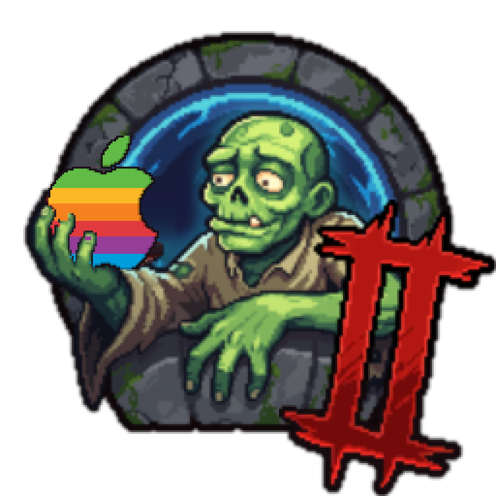

<p align="center"></p>

# GraveMac Keeper 2

Play **Graveyard Keeper 2** (Windows-only on Steam) on an Apple Silicon Mac.
One script wraps the Windows build in Wine + Apple's D3DMetal (Game Porting Toolkit)
and gives you a normal `Graveyard Keeper 2.app` in `~/Applications`.

> Unofficial fan wrapper. Not affiliated with Lazy Bear Games or tinyBuild.
> **You need to own the game on Steam.** This repo contains no game files.

## Requirements

- Apple Silicon Mac, macOS 14 (Sonoma) or newer
- [Homebrew](https://brew.sh)
- Graveyard Keeper 2 in your Steam library and ~3 GB free disk

## Install

```sh
git clone https://github.com/<you>/gravemac-keeper-2 && cd gravemac-keeper-2
./gk2.sh setup
```

`setup` installs Rosetta 2, [Gcenx's Game Porting Toolkit build](https://github.com/Gcenx/game-porting-toolkit),
creates a Wine prefix in `~/Games/gk2-prefix` and builds the app.

Then download the Windows version through **Mac Steam** (it won't offer an Install button, this is the workaround):

1. Open the Steam console: `open steam://open/console`
2. Type `download_depot 4358690 4358691` and press Enter
3. Wait for `Depot download complete` (≈1.5 GB)
4. `./gk2.sh import`
5. Open **Graveyard Keeper 2** from `~/Applications`

**Game update?** Repeat steps 2–4.

## Bringing your Steam Cloud saves

The game runs without a Steam connection, so cloud saves don't sync automatically.

1. Go to <https://store.steampowered.com/account/remotestorageapp/?appid=4358690>
2. Download the `Steam_1.dat` / `.info` files (and backups if you want)
3. Put them in
   `~/Games/gk2-prefix/drive_c/users/crossover/AppData/LocalLow/Lazy Bear Games/Graveyard Keeper 2/`

Saves made on the Mac stay on the Mac. To get cloud sync/achievements, install
Windows Steam in the prefix (`./gk2.sh steam-setup`, then `./gk2.sh steam` to log in).
`run` starts it in the background if present. This path is experimental.

## Commands

| Command | Does |
|---|---|
| `setup` | Rosetta, GPTK, Wine prefix, app bundle |
| `import` | Moves the Steam console download into the prefix |
| `run` | Launches the game (what the app does) |
| `app` | Rebuilds `~/Applications/Graveyard Keeper 2.app` |
| `steam-setup` / `steam` | Optional Windows Steam in the prefix |

Use a different prefix with `GK2_PREFIX=/path ./gk2.sh …`.

## Known issues / untested

- Intel Macs: untested (GPTK targets Apple Silicon)
- Windows Steam window may render black under Wine
- Controllers: untested

## Uninstall

```sh
rm -rf ~/Games/gk2-prefix ~/Applications/"Graveyard Keeper 2.app"
brew uninstall --cask game-porting-toolkit
```

## Credits

Game and original icon art © Lazy Bear Games. `assets/icon.png` is the game's icon with the
skull swapped for a pixel rainbow Apple logo (`assets/make-icon.py`). Wine/GPTK packaging by [Gcenx](https://github.com/Gcenx).
